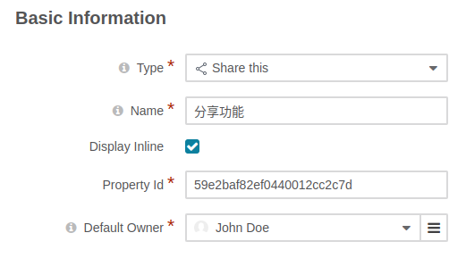
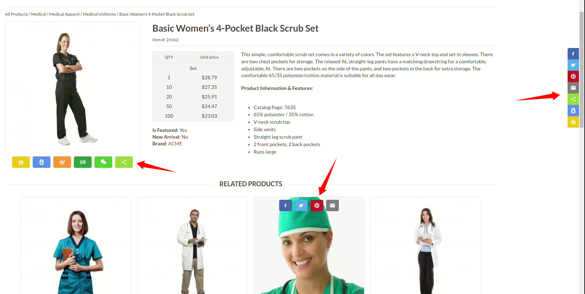

# orocommerce social share
### add share this to your orocommerce product detail page

# install:
`composer install jinber/oro-share-this-bundle`

#### clean cache
`php bin/console c:c`
#### update database
`php bin/console d:s:u --force`

# setting:

# display:

# about me

#### I am freelance of Chinese,I can development symfony,react,flutter application

#### i have prestashop and orocommerce extensions development experience.

#### you can contact me with email: 43412512#qq.com (use @ replace #)

#### or WeChat is 43412512